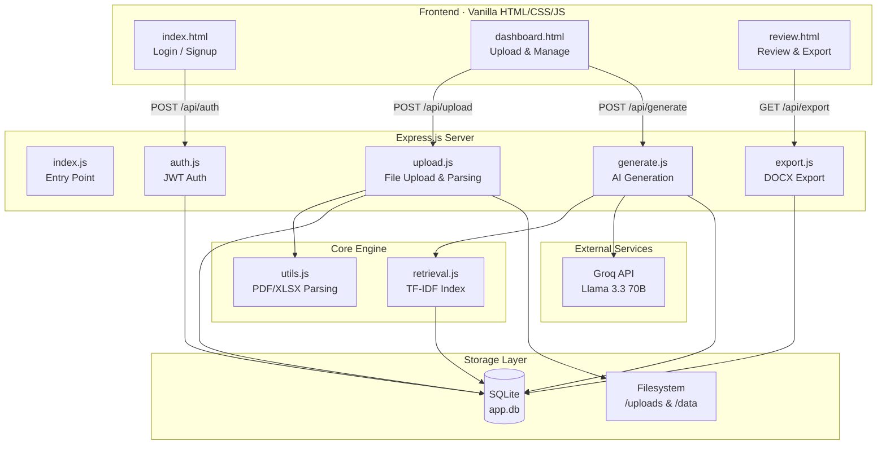
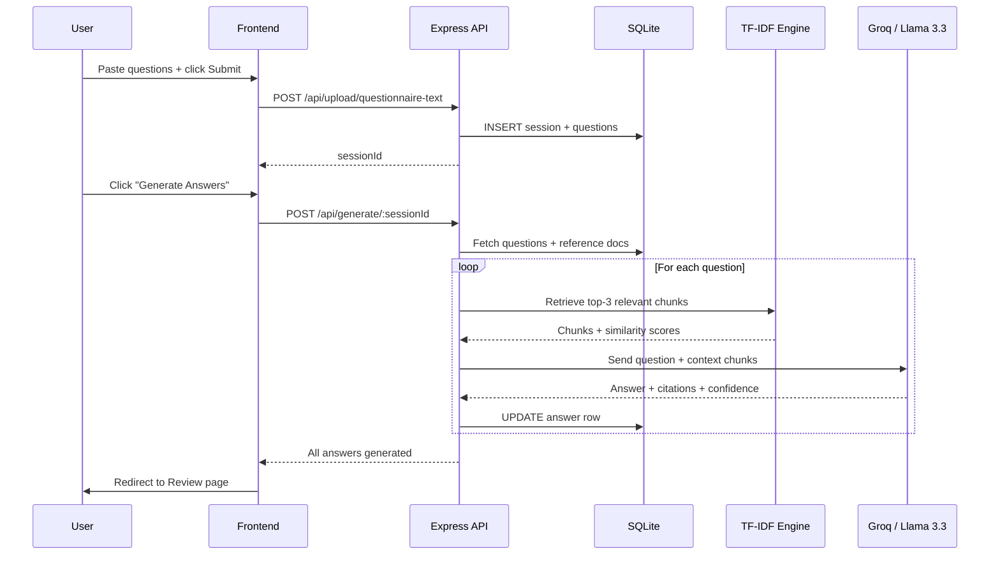
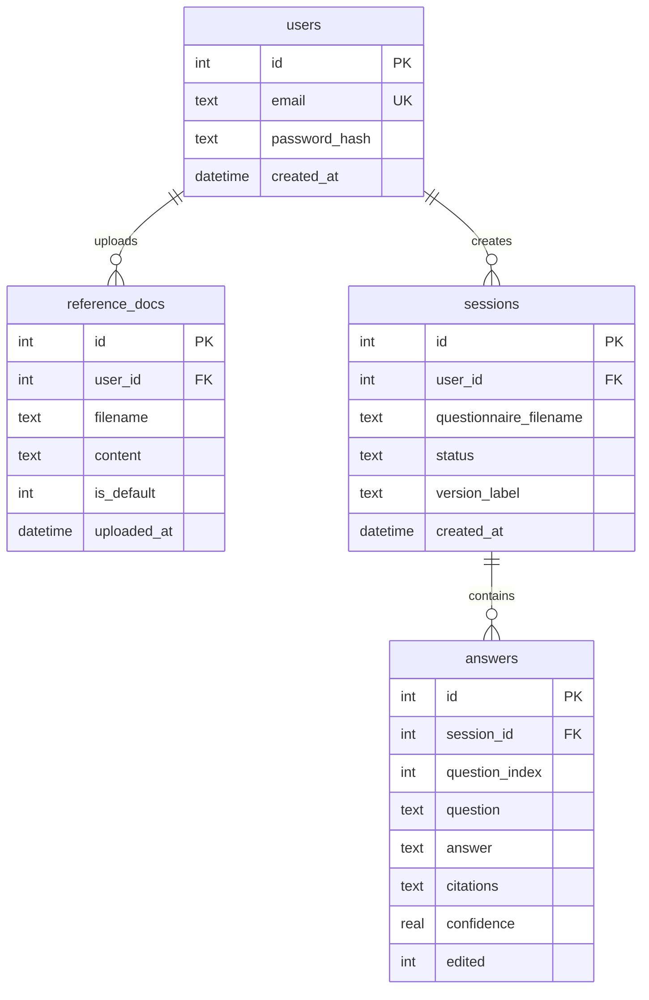
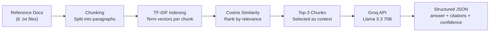

# CloudVault Questionnaire Answering Tool

An AI-powered web application that automates answering structured questionnaires (security reviews, vendor assessments, compliance forms) by retrieving information directly from a company's internal reference documents.

Instead of manually searching through PDFs and policies, users can upload a questionnaire (or paste it), and the AI will generate answers grounded in the uploaded reference documents, complete with citations.

---

## 🛠 What Was Built

### Core Features
- **Tabbed Questionnaire Input:** Users can either upload a `.txt` questionnaire file or directly paste/type their questions into a textarea.
- **Reference Document Management:** Users can upload their own `.txt` reference files. The system also comes pre-seeded with 6 built-in sample reference documents that cannot be deleted.
- **AI Answer Generation:** Powered by Llama 3.3 70B via the Groq API. It uses a custom TF-IDF retrieval system (Retrieval-Augmented Generation or RAG) to find the most relevant document chunks to answer each question.
- **Citations & Confidence:** Every generated answer includes the source document filename, the exact excerpt used, and a confidence score based on retrieval similarity.
- **Review & Edit Flow:** Users can review the AI-generated answers, edit them inline if they are inaccurate or need refinement, and see exactly where the information came from.
- **Professional DOCX Export:** The final reviewed questionnaire can be exported to a beautifully formatted `.docx` file complete with metadata, statistics, clean dividers, and shaded citation tables.
- **Authentication:** JWT-based user authentication using SQLite and `bcryptjs`.

### Tech Stack
- **Frontend:** Vanilla HTML, CSS, and plain JavaScript. No heavy frameworks.
- **Backend:** Node.js with Express.
- **Database:** SQLite (`better-sqlite3`) using WAL mode for concurrent access.
- **AI/LLM:** Groq API (Llama 3.3 70B Versatile).
- **Libraries:** `docx` for document generation, `multer` for file uploads, `jsonwebtoken` for auth.

---

## 🤔 Assumptions Made

1. **Text-First Processing:** I assumed that restricting inputs (both questionnaires and reference docs) specifically to plain `.txt` format or direct text pasting would result in the most reliable and accurate parsing. Parsing complex PDFs or nested Excel sheets often introduces formatting noise that degrades AI RAG performance.
2. **Local TF-IDF over Vector DB:** I assumed that for a lightweight MVP, a custom in-memory TF-IDF (Term Frequency-Inverse Document Frequency) index would be sufficient and vastly simplify the deployment architecture compared to setting up a dedicated vector database like Pinecone or Milvus. 
3. **Question Numbering:** I assumed that pasted questionnaires would generally follow standard numbering formats (e.g., `1. `, `Q1)`, `1- `), and wrote a regex parser to automatically strip these out so the AI only sees the core question.
4. **Single-Tenant Feel:** While the DB supports multiple users, the UI and flow were designed assuming a single security/compliance analyst working on one major assessment at a time, hence the focus on a clean, distraction-free dashboard.

---

## ⚖️ Trade-offs

1. **Vanilla JS/HTML/CSS vs. React/Next.js:**
   - *Trade-off:* Chose Vanilla JS to keep the footprint incredibly small, fast, and easy to run without a build step.
   - *Cost:* Managing state (status updates, tab switching, toast notifications) requires more manual DOM manipulation. It becomes harder to scale complex UI components.
2. **TF-IDF vs. Semantic Vector Embeddings:**
   - *Trade-off:* Used an in-memory TF-IDF algorithm for document retrieval instead of OpenAI/HuggingFace embeddings.
   - *Cost:* TF-IDF only matches exact keywords and stems. It doesn't understand "semantic meaning" (e.g., it might struggle to match the question "How do you protect databases?" with the document text "We encrypt our SQL storage").
3. **SQLite vs. PostgreSQL:**
   - *Trade-off:* SQLite is file-based and requires zero external setup.
   - *Cost:* It's not suited for massive horizontal scaling or distributed serverless environments (like Vercel) where the filesystem is ephemeral without external volume attachments.

---

## 🚀 What I Would Improve With More Time

1. **Semantic Search (Vector Embeddings):**
   - Upgrade the RAG pipeline to use an embedding model (like `text-embedding-3-small` or open-source equivalents) and a lightweight vector store like ChromaDB or pgvector. This would massively improve answer accuracy by understanding intent rather than just keywords.
2. **Advanced Document Parsing:**
   - Add support for complex PDFs (using OCR if necessary), Word documents, and Excel spreadsheets using dedicated parsing APIs like LlamaParse or Unstructured.io, while maintaining clean Markdown/text outputs for the LLM.
3. **Streaming AI Responses:**
   - Currently, the user waits until the entire questionnaire is processed before seeing results. I would implement Server-Sent Events (SSE) or WebSockets to stream answers in real-time as they are generated by the Groq API.
4. **Agentic Multi-Turn Refinement:**
   - If an answer's confidence is low, implement an agentic loop where the AI realizes it doesn't have enough context, formulates a new, different search query against the reference docs, and tries again before giving up.
5. **Modern Frontend Framework:**
   - Migrate the frontend to React/Next.js and TailwindCSS for better component reusability, state management, and easier implementation of complex UI patterns like drag-and-drop reordering of questions.

---

## 🏗 Architecture

### System Overview

### Request Flow — Generating Answers

### Data Model

### RAG Pipeline

